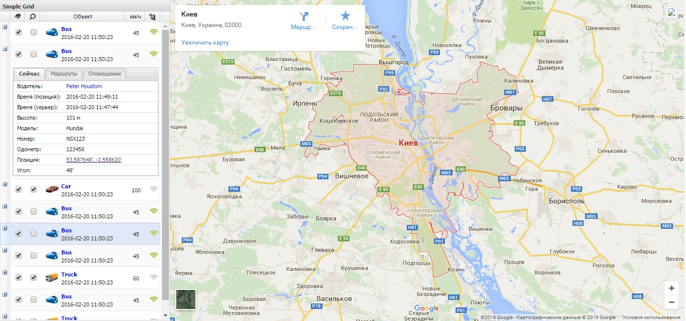

# [Traccar](http://40.85.89.103:8082/?locale=ru)

* (Overview) http://examples.sencha.com/gxt/4.0.0/examples/explorer-gray.html#

* (Basic Tabs) http://examples.sencha.com/gxt/4.0.0/examples/explorer-gray.html#ExamplePlace:basictabs
*
* (Basic Simple grid (Uibinder)) http://examples.sencha.com/gxt/4.0.0/examples/explorer-gray.html#ExamplePlace:basicsimplegrid(uibinder)
*                  (Filter Grid) http://examples.sencha.com/gxt/4.0.0/examples/explorer-gray.html#ExamplePlace:filtergrid
*                  (Paging Grid) http://examples.sencha.com/gxt/4.0.0/examples/explorer-gray.html#ExamplePlace:paginggrid
*           (Combo Box Advanced) http://examples.sencha.com/gxt/4.0.0/examples/explorer-gray.html#ExamplePlace:comboboxadvanced
*             (Combo Box Styled) http://examples.sencha.com/gxt/4.0.0/examples/explorer-gray.html#ExamplePlace:comboboxstyled
*        (Horizontal Box Layout) http://examples.sencha.com/gxt/4.0.0/examples/explorer-gray.html#ExamplePlace:horizontalboxlayout
*            (Horizontal Layout) http://examples.sencha.com/gxt/4.0.0/examples/explorer-gray.html#ExamplePlace:horizontallayout
*                    (Cell Grid) http://examples.sencha.com/gxt/4.0.0/examples/explorer-gray.html#ExamplePlace:cellgrid
*  (Horizontal Layout) http://examples.sencha.com/gxt/4.0.0/examples/explorer-gray.html#ExamplePlace:horizontallayout
*         (Basic Tabs) http://examples.sencha.com/gxt/4.0.0/examples/explorer-gray.html#ExamplePlace:basictabs
* 
*     (Check Box Grid) http://examples.sencha.com/gxt/4.0.0/examples/explorer-gray.html#ExamplePlace:checkboxgrid
*
*  (Row Editable Grid) http://examples.sencha.com/gxt/4.0.0/examples/explorer-gray.html#ExamplePlace:roweditablegrid
*         (Basic Grid) http://examples.sencha.com/gxt/4.0.0/examples/explorer-gray.html#ExamplePlace:basicgrid
*  (Row Expander Grid) http://examples.sencha.com/gxt/4.0.0/examples/explorer-gray.html#ExamplePlace:rowexpandergrid
. (Combo Box Advanced) http://examples.sencha.com/gxt/4.0.0/examples/explorer-gray.html#ExamplePlace:comboboxadvanced
*   (Accordion Layout) http://examples.sencha.com/gxt/4.0.0/examples/explorer-gray.html#ExamplePlace:accordionlayout

http://localhost:8081/SenchaGXTEjemplo
http://localhost:8083/MapGWT_GXT

                                            (gwt-maps-gxt)
** (Google Maps ** Using Google maps API with GXT and GWT) https://docs.sencha.com/gxt/3.x/apis/GoogleMaps.html
                                                           https://developers.google.com/maps/documentation/javascript/
                                                           [https://www.google.com.ua/maps/@46.9330645,32.007997,11z?hl=ru](https://www.google.com.ua/maps/@46.9330645,32.007997,11z?hl=ru)
                                                           http://c.gwt-examples.com/api/google-maps-v3
                                                           http://blog.vercer.com/2012/12/google-maps-v3-with-gwt-example.html
                                                           https://www.sencha.com/forum/showthread.php?119681-Rendering-Google-MAPS-in-GXT
                                                           https://www.sencha.com/forum/showthread.php?170540-Ext-GWT-google-maps
                           (github.com ** gwt-google-apis) https://github.com/googlearchive/gwt-google-apis
                                 (Basic Google V3 example) http://demo.gwt-openlayers.org/gwt_ol_showcase/GwtOpenLayersShowcase.html?example=Basic%20Google%20V3%20example
                     (GWT Google Map (Static and Dynamic)) http://peyotest.blogspot.com/2011/03/gwt-google-map-static-and-dynamic.html
                                    (Gwt Maps Gxt » 1.0.0) http://mvnrepository.com/artifact/com.claudiushauptmann/gwt-maps-gxt/1.0.0
**                (SENCHA MAP & TABPANEL SIZE ISSUE [FIX]) https://techtalktone.wordpress.com/2012/03/13/sencha-map-tabpanel-size-issue-fix/
**          (сгенерить кодля для >> google-maps to iframe) https://www.embed-map.com/
                                                           https://www.google.com.ua/maps/@50.3551709,30.3359953,8.75z

*  (GXT 3.0 Guides ** Grid widget) https://docs.sencha.com/gxt-guides/3/ui/widgets/grid/Grid.html
** (GWTP-GXT3-SAMPLES) https://github.com/lmignon/GWTP-GXT3-SAMPLES
                       https://github.com/lmignon/GWTP-GXT3-SAMPLES/tree/master/sample-tab/src/main/java/eu/acsone/client/gxt/tabs
                       https://github.com/lmignon/GWTP-GXT3-SAMPLES/blob/master/sample-tab/src/main/java/eu/acsone/client/gxt/tabs/SimpleTabPanel.java
                       https://github.com/lmignon/GWTP-GXT3-SAMPLES/blob/master/sample-tab/src/main/java/eu/acsone/client/gxt/tabs/SimpleTab.java

* (MarginData center ** setMargins ** setWestWidget ** BorderLayoutContainer) https://github.com/Home-GWT/MapGWT_GXT/blob/release/src/main/java/com/map/gxt/client/tables/layout/HBoxLayoutExample2.java

   (Listen to tab selection event (Ext GWT) ** Tab « GWT « Java) http://www.java2s.com/Code/Java/GWT/ListentotabselectioneventExtGWT.htm
           (com.extjs.gxt.ui.client ** a grid in tabPanel error) http://stackoverflow.com/questions/6723882/a-grid-in-tabpanel-error
    (Working With GXT (Ext GWT) Grid : Add Filter Functionality) http://zawoad.blogspot.com/2011/02/working-with-gxt-ext-gwt-grid-add.html
*            (GXT3 Grid Cell with clickable Image and hyperlink) http://peyotest.blogspot.com/2013/10/gxt3-grid-cell-with-clickable-image-and.html
                                                                 http://stackoverflow.com/questions/24581625/how-to-display-the-same-image-in-every-row-in-gxt-grid
 (Java Code Examples for com.google.gwt.cell.client.AbstractCel) http://www.programcreek.com/java-api-examples/index.php?api=com.google.gwt.cell.client.AbstractCell
 
** (How to create a simple Grid using GXT(Ext GWT) ** GxtGridExample) http://zawoad.blogspot.com/2009/08/how-to-create-simple-grid-using-gxtext.html
(Как работать с GXT Grid ** Не могу вывести содержимое в Grid, имеется класс EmpDTO с такими полями) http://javatalks.ru/topics/26204

* (Google Web Toolkit (GWT) & Servlets - Web application tutorial) http://www.digizol.com/2008/09/java-gwt-servlets-web-app-tutorial.html

(WindowState state = stateHandler.getState().getWindowState().get(stateId) ** window.setPixelSize(state.getWidth(), state.getHeight())) http://extjs-public.googlecode.com/svn/gxt-3.x/release/examples-src/com/sencha/gxt/explorer/client/misc/WindowStateExample.java

*** (Разработка веб-приложения ** При изучении технологий Ext JS и Java, написал web-приложение «Каталог автомобилей») https://habrahabr.ru/post/240033/

                  (originalValue.toUpperCase()) http://stackoverflow.com/questions/30870588/how-to-apply-style-on-a-textfield-in-a-treegrid-sencha-gxt-3-1
   (.setHeader(SafeHtmlUtils.fromTrustedString) https://www.sencha.com/forum/archive/index.php/t-250591.html?s=4ab77cfc429813fd92946941f1f35a59
      
*** (Basic Grid using UiBinder in GXT3) http://healthycoder.in/basic-grid-using-uibinder-in-gxt3/
                                        https://github.com/prabhu-durasoft/BasicGridUIBinderGXT3/blob/master/src/com/durasoft/client/ui/CountryGridExample.java
    (GXT grid auto columns width) http://wenda.soso.io/questions/4475857/gxt-grid-auto-columns-width
                                        
*   (Ext JS 4 Grid «на пальцах») https://habrahabr.ru/post/169125/

    (Working with GXT(Ext GWT) Grid : Create an Editable Grid) http://zawoad.blogspot.com/2009/09/working-with-gxtext-gwt-grid-create.html
    (branflake2267/GridInlineEditingTest.java) https://gist.github.com/branflake2267/11091554
    (Autofit Column Width in a GXT Grid) http://greatlogic.com/2014/06/02/autofit-column-width-in-a-gxt-grid/
    (Column Style ** Column alignments) https://docs.sencha.com/gxt/3.x/ui/grid/columns/ColumnStyle.html
                                        https://docs.sencha.com/gxt-guides/3/ui/widgets/grid/columns/ColumnStyle.html
    (SafeHtmlUtils) https://docs.sencha.com/gxt/3.x/ui/SafeHtml.html
    https://reminiscential.wordpress.com/2010/02/09/gxt-widget-expander-1-0-release/
    