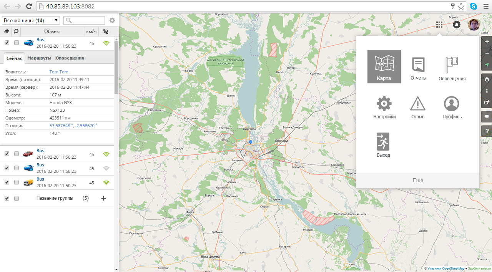

# [Traccar](http://40.85.89.103:8082/?locale=ru)

* http://examples.sencha.com/gxt/4.0.0/examples/explorer-gray.html#
* http://examples.sencha.com/gxt/4.0.0/examples/explorer-gray.html#ExamplePlace:basictabs
* http://examples.sencha.com/gxt/4.0.0/examples/explorer-gray.html#ExamplePlace:basicsimplegrid(uibinder)
* http://examples.sencha.com/gxt/4.0.0/examples/explorer-gray.html#ExamplePlace:filtergrid
* http://examples.sencha.com/gxt/4.0.0/examples/explorer-gray.html#ExamplePlace:paginggrid
* http://examples.sencha.com/gxt/4.0.0/examples/explorer-gray.html#ExamplePlace:comboboxadvanced
* http://examples.sencha.com/gxt/4.0.0/examples/explorer-gray.html#ExamplePlace:comboboxstyled
* http://examples.sencha.com/gxt/4.0.0/examples/explorer-gray.html#ExamplePlace:horizontalboxlayout
* http://examples.sencha.com/gxt/4.0.0/examples/explorer-gray.html#ExamplePlace:horizontallayout
* http://examples.sencha.com/gxt/4.0.0/examples/explorer-gray.html#ExamplePlace:cellgrid

* http://localhost:8081/SenchaGXTEjemplo

* (MarginData center ** setMargins ** setWestWidget ** BorderLayoutContainer) https://github.com/Home-GWT/MapGWT_GXT/blob/release/src/main/java/com/map/gxt/client/tables/layout/HBoxLayoutExample2.java

* (Overview) http://examples.sencha.com/gxt/4.0.0/examples/explorer-gray.html#
* (Horizontal Layout) http://examples.sencha.com/gxt/4.0.0/examples/explorer-gray.html#ExamplePlace:horizontallayout
* (Basic Tabs) http://examples.sencha.com/gxt/4.0.0/examples/explorer-gray.html#ExamplePlace:basictabs
* (Filter Grid) http://examples.sencha.com/gxt/4.0.0/examples/explorer-gray.html#ExamplePlace:filtergrid
* (Cell Grid) http://examples.sencha.com/gxt/4.0.0/examples/explorer-gray.html#ExamplePlace:cellgrid
* (Check Box Grid) http://examples.sencha.com/gxt/4.0.0/examples/explorer-gray.html#ExamplePlace:checkboxgrid

http://localhost:8083/MapGWT_GXT/

                                            (gwt-maps-gxt)
** (Google Maps ** Using Google maps API with GXT and GWT) https://docs.sencha.com/gxt/3.x/apis/GoogleMaps.html
                                                           https://developers.google.com/maps/documentation/javascript/
                                    (Gwt Maps Gxt » 1.0.0) http://mvnrepository.com/artifact/com.claudiushauptmann/gwt-maps-gxt/1.0.0